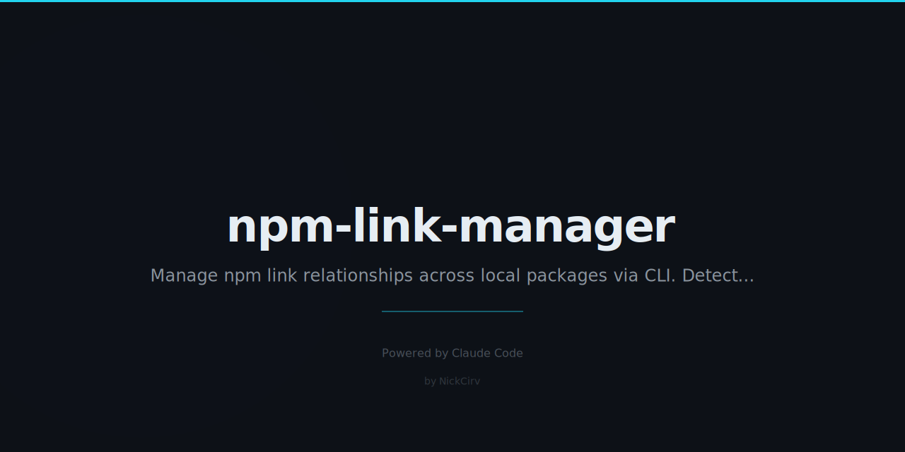

# npm-link-manager

**Zero-dependency CLI for managing npm link relationships across local packages.**

Track which packages are linked where, detect stale links, and make monorepo-style local development easier — with no external dependencies.

## Installation

```bash
npm install -g npm-link-manager
```

Or use directly with npx:

```bash
npx npm-link-manager --help
```

## Usage

Both `npm-link-manager` and the shorter alias `nlm` are available.

```
nlm <command> [options]
```

## Commands

### `nlm list`

Show all active npm links on your machine.

```
  ✔  my-library  v2.1.0
       /Users/you/projects/my-library  3d ago

  ✖  old-package  (broken — target no longer exists)
```

Scans the global npm prefix for symlinks, shows version, real path, and age. Broken links are highlighted in red.

---

### `nlm link <package-dir>`

Link a local package globally (wraps `npm link`).

```bash
nlm link ../my-library
nlm link /Users/you/projects/shared-utils
```

---

### `nlm unlink <package-name>`

Remove a global link (wraps `npm unlink -g`).

```bash
nlm unlink my-library
```

---

### `nlm use <package-name> [--in <project-dir>]`

Use a globally linked package in a specific project. Defaults to the current directory.

```bash
nlm use my-library
nlm use my-library --in ./apps/web
```

Verifies the global link exists and is healthy before linking locally.

---

### `nlm status [<project-dir>]`

Show the link status of all dependencies in a project's `package.json`.

```
  Dependency link status for my-app

  🔗  my-library                         v2.1.0       /Users/you/projects/my-library
      react                              ^18.2.0
      typescript                         ^5.0.0
```

Linked dependencies are marked with 🔗 and show the real path.

---

### `nlm doctor`

Detect and report issues across all links and tracked projects.

Checks:
- **Broken symlinks** — target directory no longer exists
- **Version mismatches** — linked version doesn't satisfy the project's semver requirement
- **Orphaned links** — globally linked but not used in any tracked project

```
  ✖  1 error(s)
  ⚠  1 warning(s)
  ℹ  1 info

  ✖  Broken symlink: old-package — target no longer exists
     Hint: Run: nlm clean

  ⚠  Version mismatch: my-lib linked as v1.0.0 but ./my-app requires ^2.0.0
     Hint: Update the linked package or adjust the specifier

  ℹ  Orphaned link: test-util is globally linked but not used in any tracked project
     Hint: Run: nlm unlink test-util
```

---

### `nlm clean`

Remove all broken symlinks from the global npm directory.

```bash
nlm clean
# → Cleaned 2/2 broken link(s).
```

---

### `nlm track <project-dir>`

Register a project directory so `nlm doctor` can check it for version mismatches and orphaned links.

```bash
nlm track ./apps/web
nlm track /Users/you/projects/my-app
```

Tracked projects are saved to `~/.npm-link-manager.json`.

---

### `nlm untrack-all [<project-dir>]`

Restore all linked dependencies in a project back to registry versions. Useful when you're done local development.

```bash
nlm untrack-all
nlm untrack-all ./apps/web
```

This finds all locally symlinked packages in the project's `node_modules`, unlinks them, and runs `npm install` to restore registry versions.

---

## Config

Project tracking data is stored in `~/.npm-link-manager.json`:

```json
{
  "trackedProjects": [
    "/Users/you/projects/my-app",
    "/Users/you/projects/another-app"
  ]
}
```

## Why zero dependencies?

This tool is meant to be a lightweight utility you install globally and forget about. Zero external dependencies means:

- No `node_modules` bloat in your global npm dir
- No supply chain risk
- Works immediately on any Node 18+ machine
- Installs in milliseconds

## Requirements

- Node.js 18+
- npm (any version)

## License

MIT
